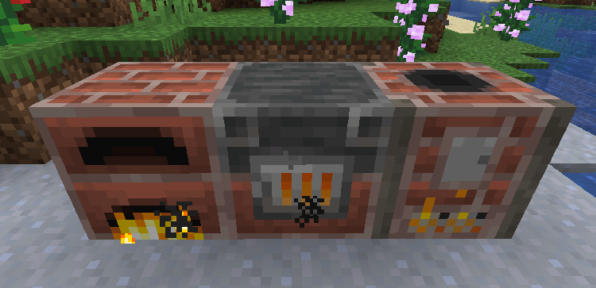
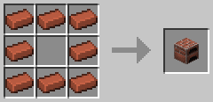
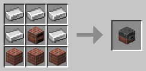
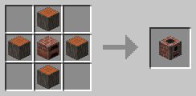

# Brick Furnace 

[.svg)](https://www.curseforge.com/minecraft/mc-mods/brick-furnace)
[.svg)](https://www.curseforge.com/minecraft/mc-mods/brick-furnace/files)

This Minecraft mod adds **Brick Furnaces** to the game. (Forge, NeoForge, Fabric, Quilt)

The Fabric / Quilt version needs the following mods:

- Fabric API ([Github](https://github.com/FabricMC/fabric), [Curseforge](https://www.curseforge.com/minecraft/mc-mods/fabric-api), [Modrinth](https://modrinth.com/mod/fabric-api))
- Cloth Config API ([Github](https://github.com/shedaniel/cloth-config), [Curseforge](https://www.curseforge.com/minecraft/mc-mods/cloth-config), [Modrinth](https://modrinth.com/mod/cloth-config))

It adds a **Brick Furnace**, a **Brick Blast Furnace** and a **Brick Smoker**. They are looking different and have other crafting recipes, but they act like the vanilla equivalents.

Villagers **can** use a **Brick Blast Furnace** or a **Brick Smoker** as workplace.

Vanilla recipes can be disabled completely or individual recipes can be blocked. 

Special recipes for the brick furnaces can be added via CraftTweaker or datapacks.

For more information check out the **Wiki**: https://github.com/cech12/BrickFurnace/wiki
